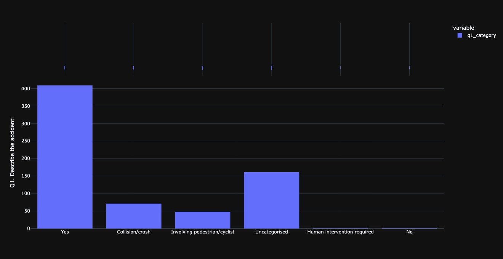
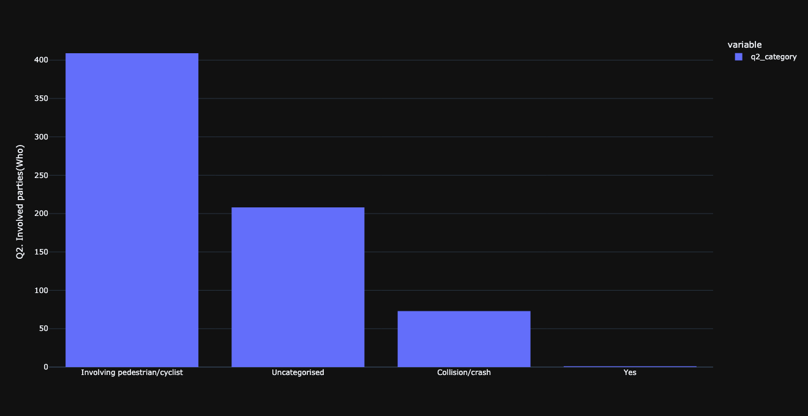
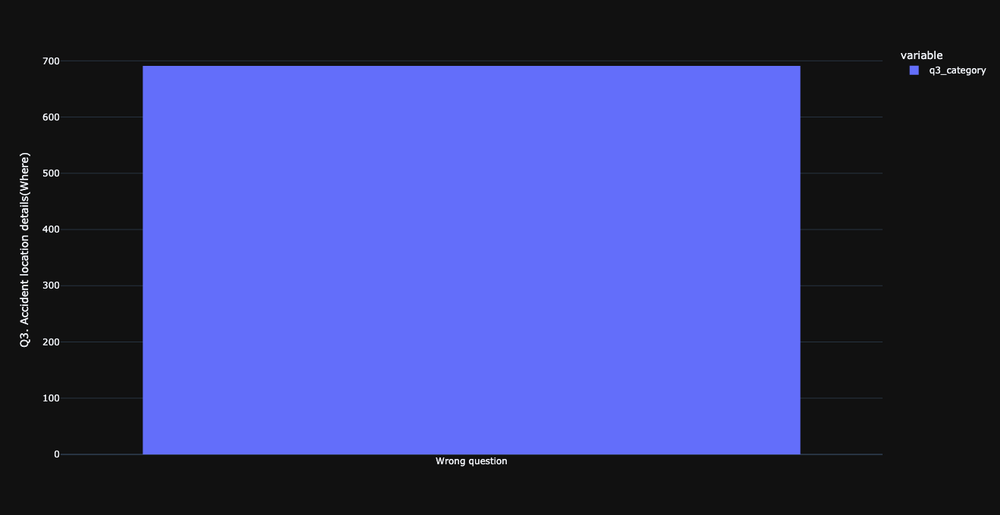
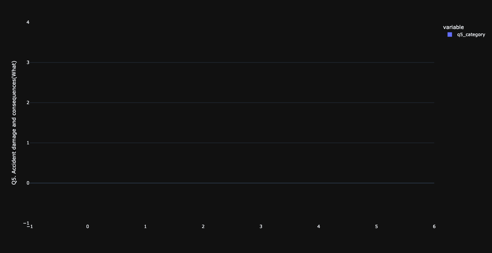
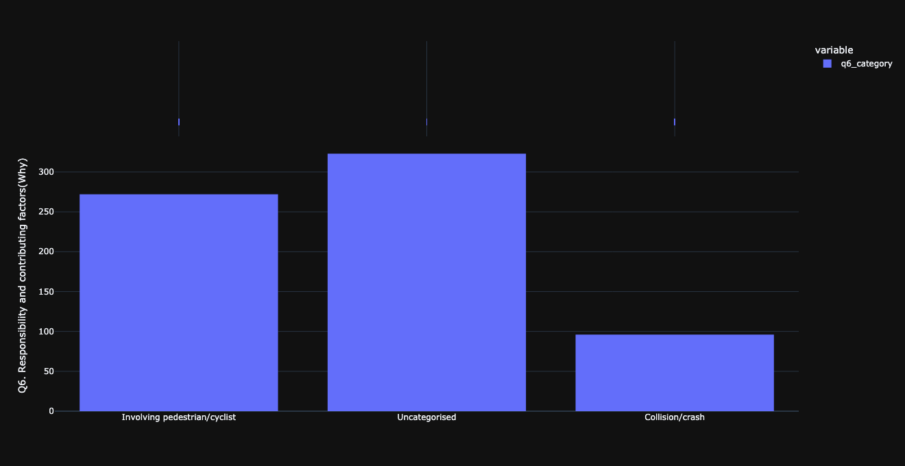

# Analysing reports of events involving automated vehicles with LLM

In the description below, it is assumed that the repo is stored in the folder `llm-events`. Terminal commands lower assume macOS.

## Setup
Tested with Python 3.9.12. To setup the environment run these two commands in a parent folder of the downloaded repository (replace `/` with `\` and possibly add `--user` if on Windows):
- `pip install -e llm-events` will setup the project as a package accessible in the environment.
- `pip install -r llm-events/requirements.txt` will install required packages.

For analysis with GPT-V, the API key of OpenAI needs to be placed in file `llm-events/secret`. The file needs to be formatted as `llm-events/secret example`.

### Configuration of project
Configuration of the project needs to be defined in `llm-events/config`. Please use the `default.config` file for the required structure of the file. If no custom config file is provided, `default.config` is used. The config file has the following parameters:
* `reports`: path with reports.
* `data`: path for CSV with output.
* `analyse`: toggle to run analysis of reports.
* `query`: query to path to LLM.
* `plotly_template`: template used to make graphs in the analysis.

## Analysis
Analysis can be started by running `python llm-events/llmevents/run.py`. A number of CSV files used for data processing are saved in `llmevents/_output`. Visualisations of all data are saved in `llmevents/_output/figures/`.

## Answers to questions in the query

Histogram of categorisation of output for question 1.

Histogram of categorisation of output for question 2.

Histogram of categorisation of output for question 3.

Histogram of categorisation of output for question 4.

Histogram of categorisation of output for question 5.

Histogram of categorisation of output for question 6.

Histogram of categorisation of output for question 7.

## Troubleshooting
### Troubleshooting setup
#### ERROR: llm-events is not a valid editable requirement
Check that you are indeed in the parent folder for running command `pip install -e llm-events`. This command will not work from inside of the folder containing the repo.