# Analysing reports of events involving automated vehicles with LLM

In the description below, it is assumed that the repo is stored in the folder `llm-events`. Terminal commands lower assume macOS.

## Setup
Tested with Python 3.9.12. To setup the environment run these two commands in a parent folder of the downloaded repository (replace `/` with `\` and possibly add `--user` if on Windows):
- `pip install -e llm-events` will setup the project as a package accessible in the environment.
- `pip install -r llm-events/requirements.txt` will install required packages.
- Windows User need specific version of kaleiod to work with Plotly `pip install kaleido==0.1.0.post1`. See [Issues](https://github.com/plotly/Kaleido/issues/134)

### NLTK Installation
The project also requires NLTK data for text processing. You can install the required NLTK resources using one of these methods:

1. Run the `download_nltk.ipynb` notebook in this project

2. Using Python code:
```python
import nltk
nltk.download('punkt')
nltk.download('stopwords')
```

3. Using command line:
```bash
python -m nltk.downloader punkt stopwords
```

For analysis with GPT-V, the API key of OpenAI needs to be placed in file `llm-events/secret`. The file needs to be formatted as `llm-events/secret example`.

### Configuration of project
Configuration of the project needs to be defined in `llm-events/config`. Please use the `default.config` file for the required structure of the file. If no custom config file is provided, `default.config` is used. The config file has the following parameters:
- **`reports`**: path with reports.
- **`data`**: path for CSV with output.
- **`analyse`**: toggle to run analysis of reports.
- **`query`**: query to path to LLM.
- **`plotly_template`**: template used to make graphs in the analysis.
- **`logger_level`**: Level of console output. Can be: debug, info, warning, error.

## Analysis
Analysis can be started by running `python llm-events/llmevents/run.py`. A number of CSV files used for data processing are saved in `llmevents/_output`. Visualisations of all data are saved in `llmevents/_output/figures/`.

## Answers to questions in the query
[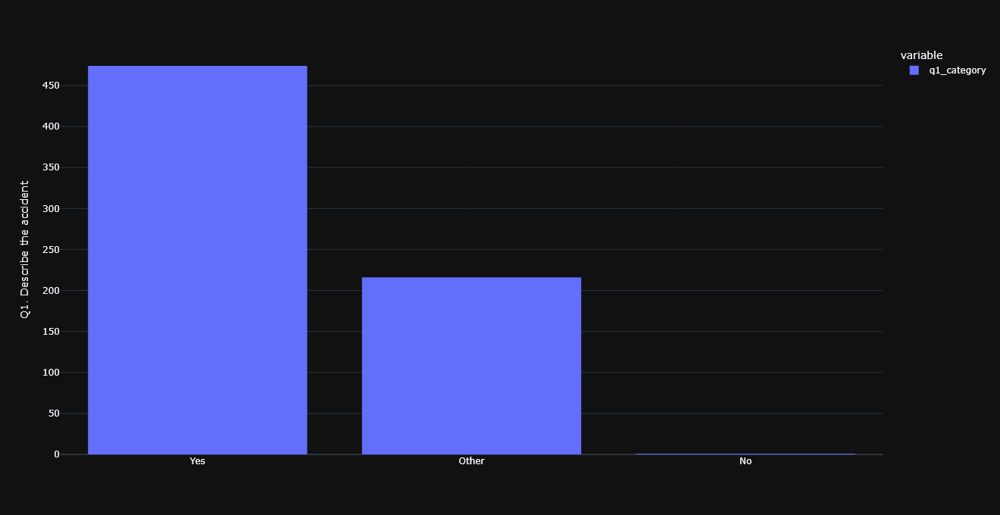](https://htmlpreview.github.io/?https://github.com/bazilinskyy/llm-events/blob/main/figures/hist_q1_category.html)
Histogram of categorisation of output for question 1.

[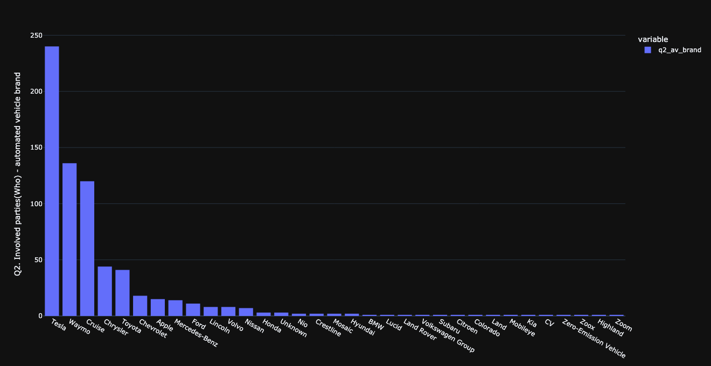](https://htmlpreview.github.io/?https://github.com/bazilinskyy/llm-events/blob/main/figures/hist_q2_av_brand.html)
Histogram of categorisation of output for question 2 - automated vehicle brand.

[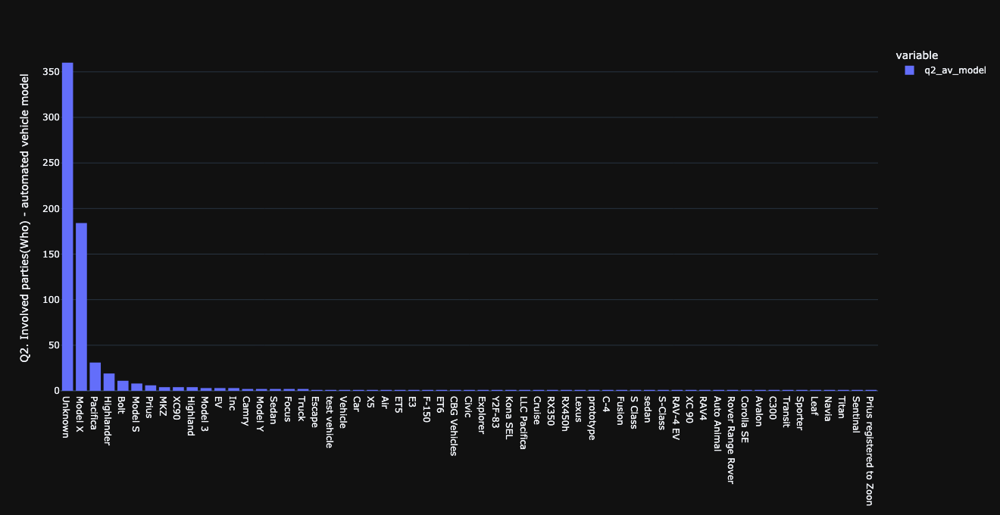](https://htmlpreview.github.io/?https://github.com/bazilinskyy/llm-events/blob/main/figures/hist_q2_av_model.html)
Histogram of categorisation of output for question 2 - automated vehicle model.

[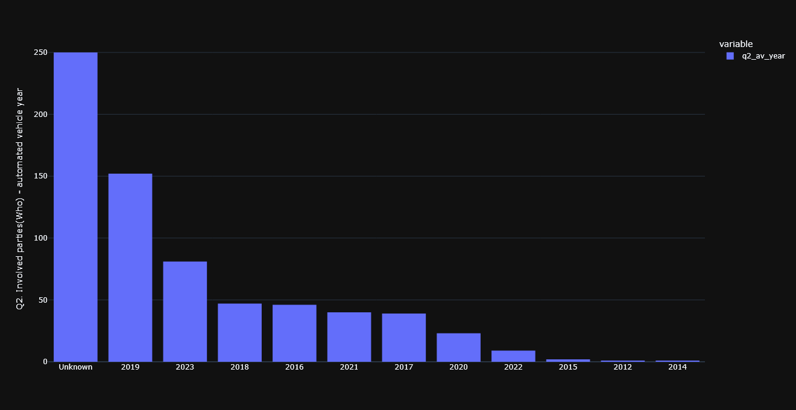](https://htmlpreview.github.io/?https://github.com/bazilinskyy/llm-events/blob/main/figures/hist_q2_av_year.html)
Histogram of categorisation of output for question 2 - automated vehicle year.

[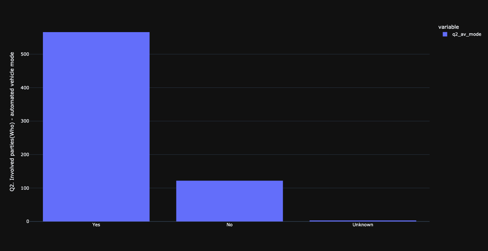](https://htmlpreview.github.io/?https://github.com/bazilinskyy/llm-events/blob/main/figures/hist_q2_av_mode.html)
Histogram of categorisation of output for question 2 - automated vehicle model mode.

[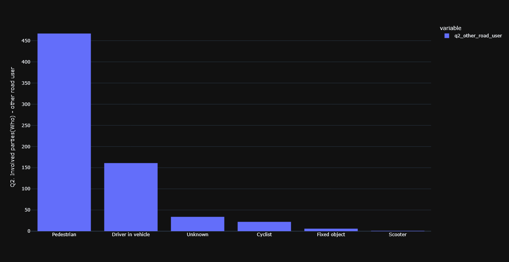](https://htmlpreview.github.io/?https://github.com/bazilinskyy/llm-events/blob/main/figures/hist_q2_other_road_user.html)
Histogram of categorisation of output for question 2 - automated vehicle.

[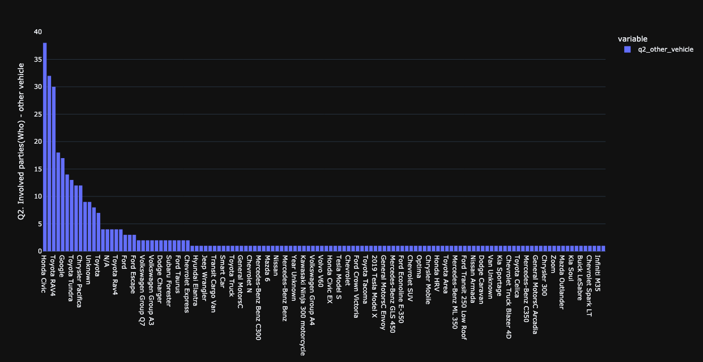](https://htmlpreview.github.io/?https://github.com/bazilinskyy/llm-events/blob/main/figures/hist_q2_other_vehicle.html)
Histogram of categorisation of output for question 2 - other vehicle.

[](https://htmlpreview.github.io/?https://github.com/bazilinskyy/llm-events/blob/main/figures/q2_av_mode.html)
Histogram of categorisation of output for question 2 - AV mode.

[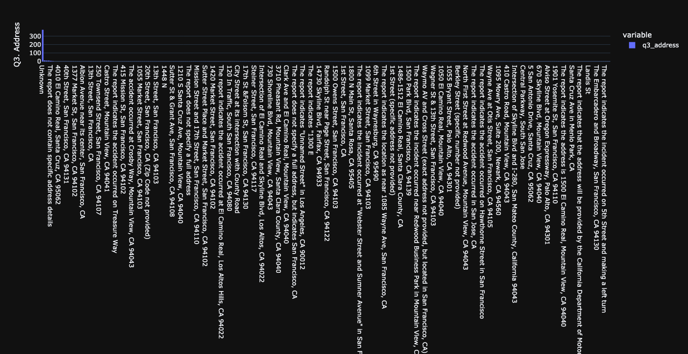](https://htmlpreview.github.io/?https://github.com/bazilinskyy/llm-events/blob/main/figures/hist_q3_address.html)
Histogram of categorisation of output for question 3 - address.

[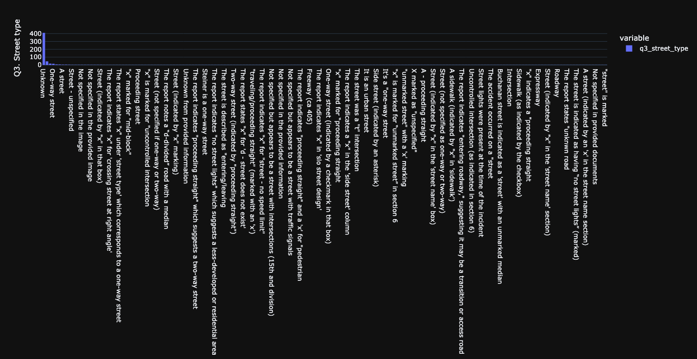](https://htmlpreview.github.io/?https://github.com/bazilinskyy/llm-events/blob/main/figures/hist_q3_street_type.html)
Histogram of categorisation of output for question 3 - street type.

[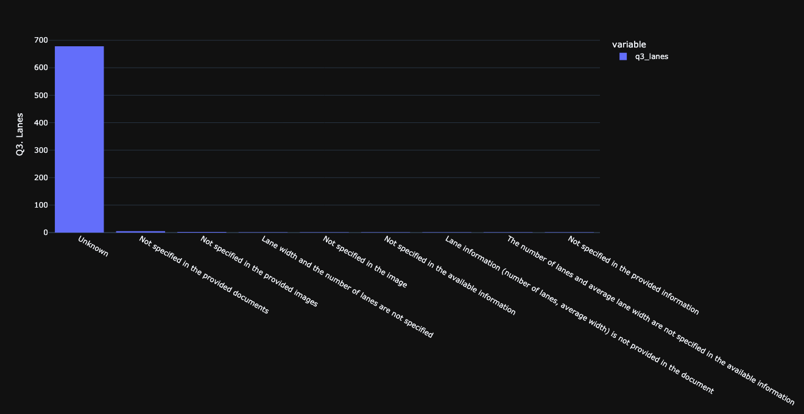](https://htmlpreview.github.io/?https://github.com/bazilinskyy/llm-events/blob/main/figures/hist_q3_lanes.html)
Histogram of categorisation of output for question 3 - lanes.

[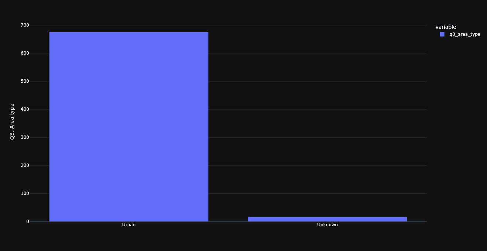](https://htmlpreview.github.io/?https://github.com/bazilinskyy/llm-events/blob/main/figures/hist_q3_area_type.html)
Histogram of categorisation of output for question 3 - area type.

[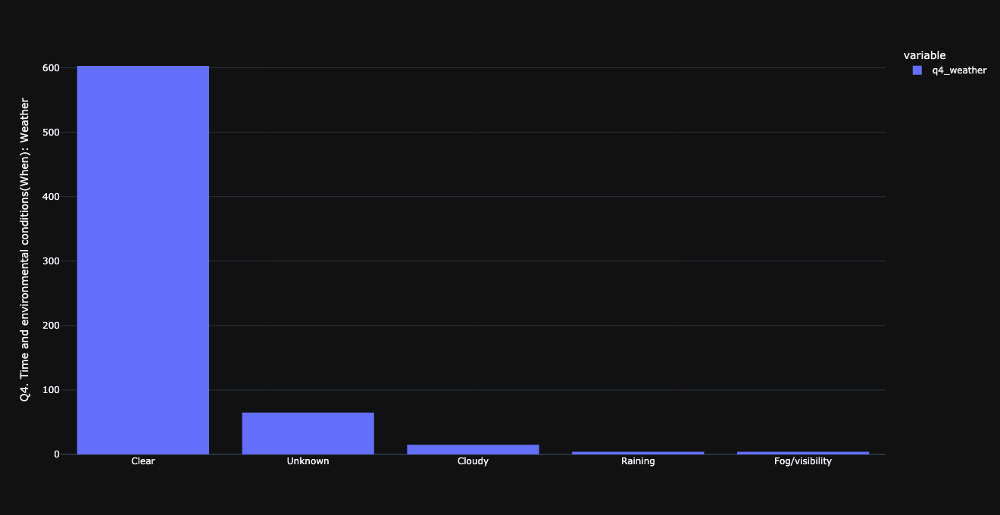](https://htmlpreview.github.io/?https://github.com/bazilinskyy/llm-events/blob/main/figures/hist_q4_weather.html)
Histogram of categorisation of output for question 4 - weather.

[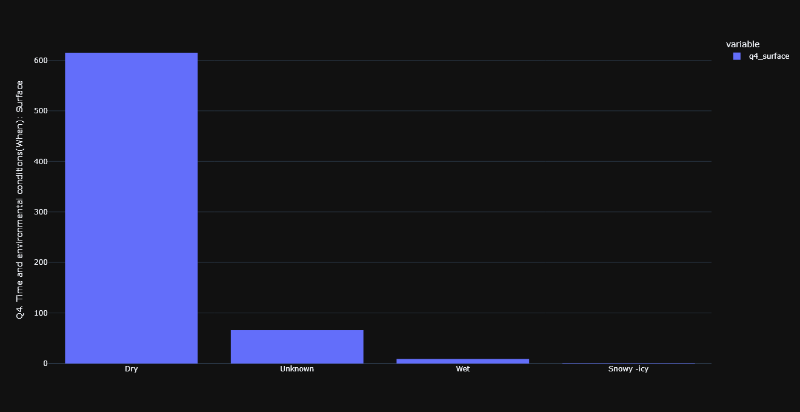](https://htmlpreview.github.io/?https://github.com/bazilinskyy/llm-events/blob/main/figures/hist_q4_surface.html)
Histogram of categorisation of output for question 4 - surface.

[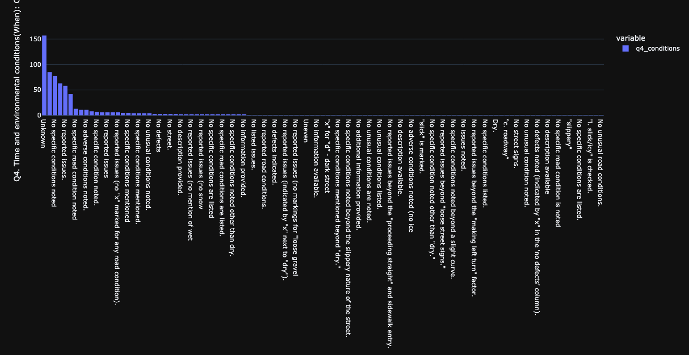](https://htmlpreview.github.io/?https://github.com/bazilinskyy/llm-events/blob/main/figures/hist_q4_conditions.html)
Histogram of categorisation of output for question 4 - conditions.

[](https://htmlpreview.github.io/?https://github.com/bazilinskyy/llm-events/blob/main/figures/hist_q4_lightning.html)
Histogram of categorisation of output for question 4 - lightning.

[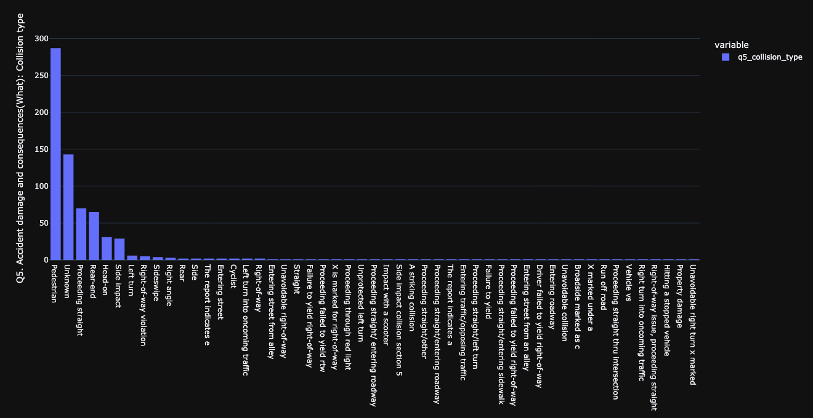](https://htmlpreview.github.io/?https://github.com/bazilinskyy/llm-events/blob/main/figures/hist_q5_collision_type.html)
Histogram of categorisation of output for question 5 - collision type.

[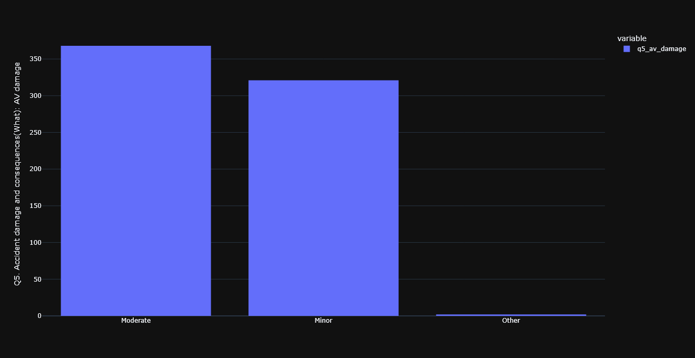](https://htmlpreview.github.io/?https://github.com/bazilinskyy/llm-events/blob/main/figures/hist_q5_av_damage.html)
Histogram of categorisation of output for question 5 - AV damage.

[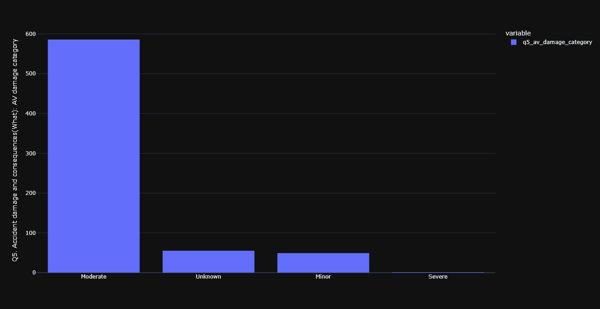](https://htmlpreview.github.io/?https://github.com/bazilinskyy/llm-events/blob/main/figures/hist_q5_av_damage_category.html)
Histogram of categorisation of output for question 5 - AV damage category.

[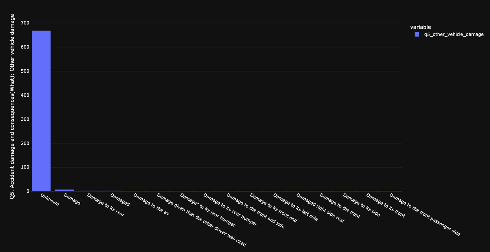](https://htmlpreview.github.io/?https://github.com/bazilinskyy/llm-events/blob/main/figures/hist_q5_other_vehicle_damage.html)
Histogram of categorisation of output for question 5 - Other vehicle damage.

[](https://htmlpreview.github.io/?https://github.com/bazilinskyy/llm-events/blob/main/figures/hist_q5_other_vehicle_damage.html)
Histogram of categorisation of output for question 5 - Injuries.

[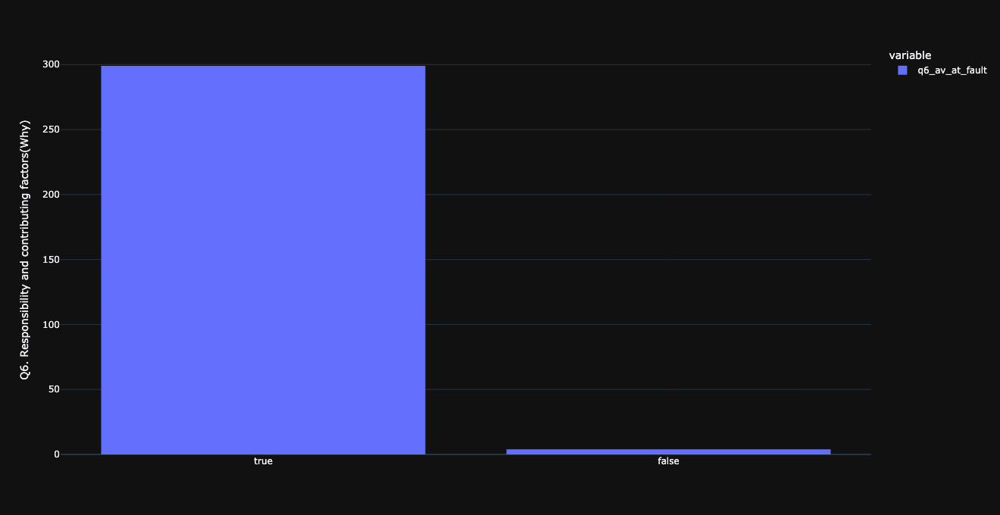](https://htmlpreview.github.io/?https://github.com/bazilinskyy/llm-events/blob/main/figures/hist_q6_av_at_fault.html)
Histogram of categorisation of output for question 6 - AV at fault.

[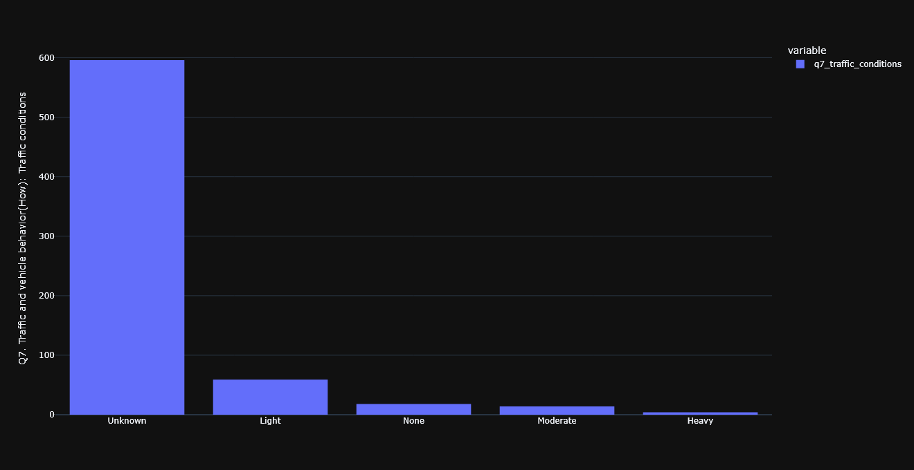](https://htmlpreview.github.io/?https://github.com/bazilinskyy/llm-events/blob/main/figures/hist_q7_traffic_conditions.html)
Histogram of categorisation of output for question 7 - traffic conditions.

[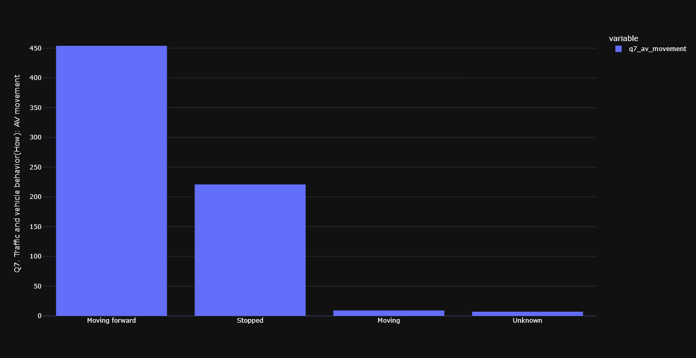](https://htmlpreview.github.io/?https://github.com/bazilinskyy/llm-events/blob/main/figures/hist_q7_av_movement.html)
Histogram of categorisation of output for question 7 - AV movement.

[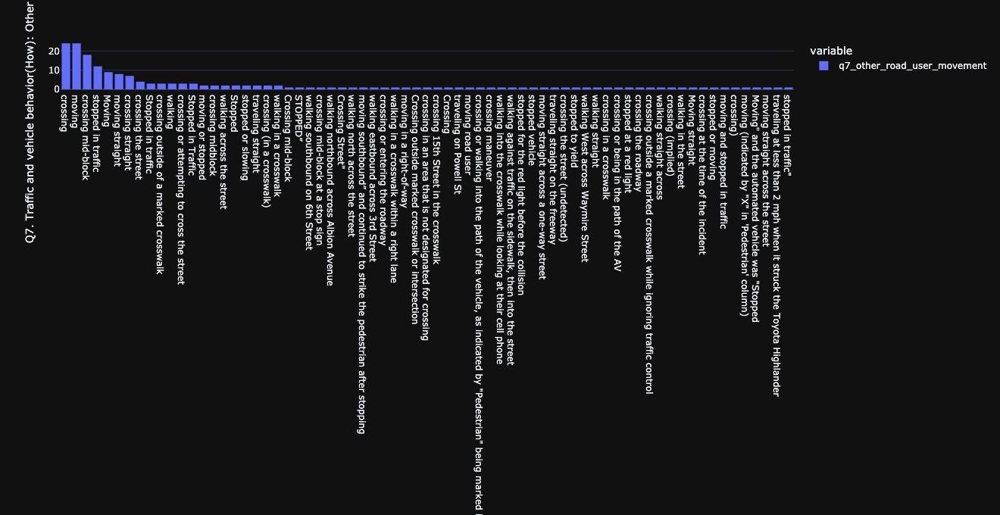](https://htmlpreview.github.io/?https://github.com/bazilinskyy/llm-events/blob/main/figures/hist_q7_other_road_user_movement.html)
Histogram of categorisation of output for question 7 - Other road user movement.

[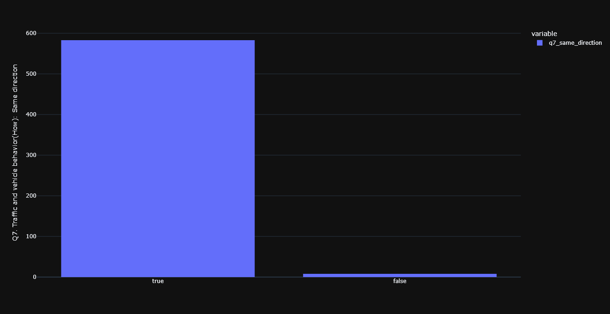](https://htmlpreview.github.io/?https://github.com/bazilinskyy/llm-events/blob/main/figures/hist_q7_same_direction.html)
Histogram of categorisation of output for question 7 - Same direction.

[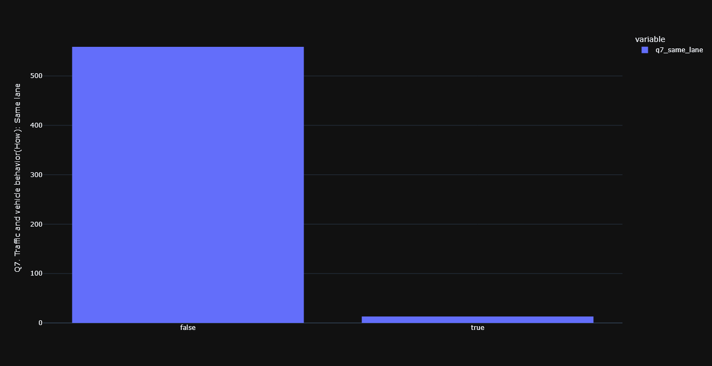](https://htmlpreview.github.io/?https://github.com/bazilinskyy/llm-events/blob/main/figures/hist_q7_same_lane.html)
Histogram of categorisation of output for question 7 - Same lane.

## Contextual analysis
[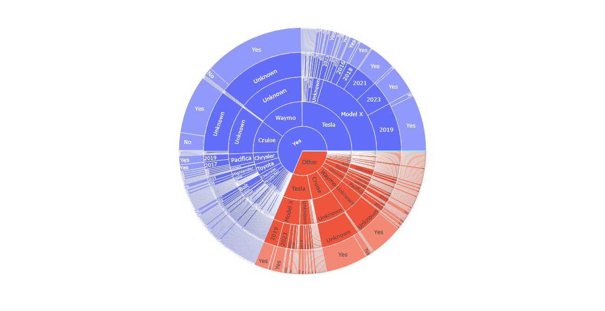](https://htmlpreview.github.io/?https://github.com/bazilinskyy/llm-events/blob/main/figures/sunburst.html)
Sunburst graph.

[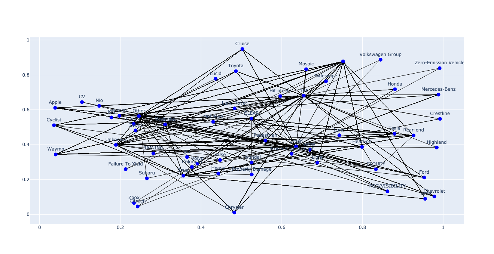](https://htmlpreview.github.io/?https://github.com/bazilinskyy/llm-events/blob/main/figures/node_graph.html)
Node graph.

[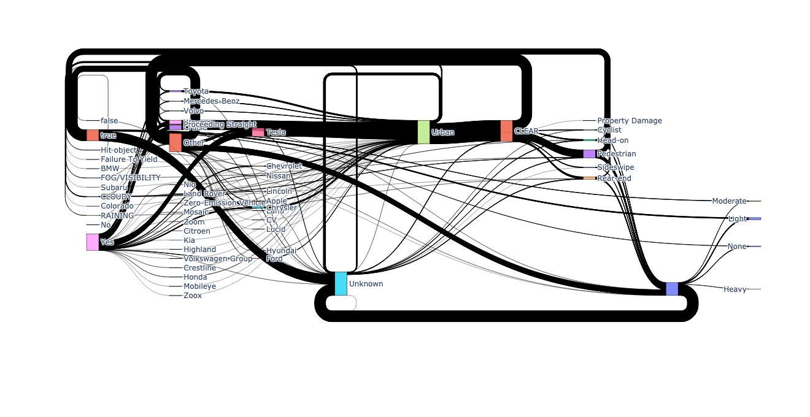](https://htmlpreview.github.io/?https://github.com/bazilinskyy/llm-events/blob/main/figures/sankey.html)
Sankey plot.

## Troubleshooting
### Troubleshooting setup
#### ERROR: llm-events is not a valid editable requirement
Check that you are indeed in the parent folder for running command `pip install -e llm-events`. This command will not work from inside of the folder containing the repo.