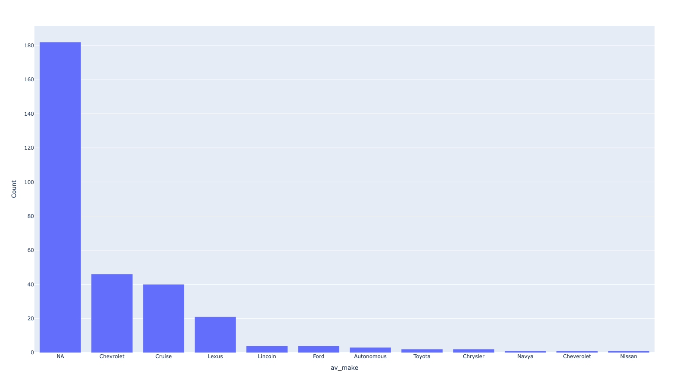
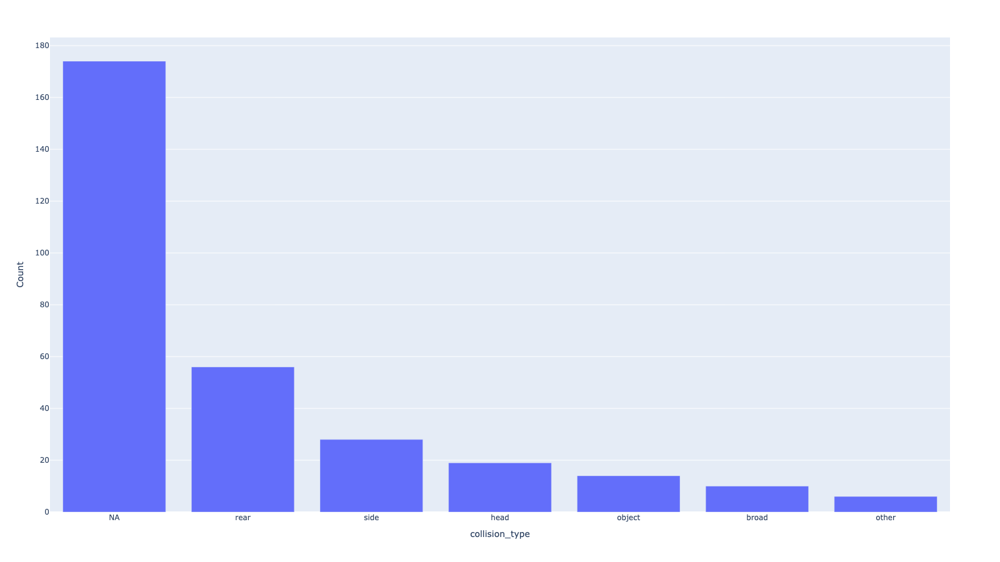
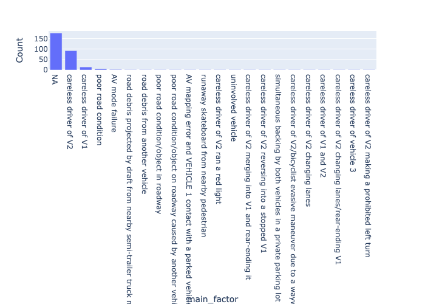

# LLM events refactor

## Citation and usage of code
If you use this work for academic work please cite the following paper:

> 

The code is open-source and free to use. It is aimed for, but not limited to, academic research. We welcome forking of this repository, pull requests, and any contributions in the spirit of open science and open-source code. For inquiries about collaboration, you may contact Md Shadab Alam (md_shadab_alam@outlook.com) or Pavlo Bazilinskyy (pavlo.bazilinskyy@gmail.com).

## Getting started
[](https://www.python.org/downloads/release/python-3919/)
[](https://docs.astral.sh/uv/)

Tested with **Python 3.12.13** and the [`uv`](https://docs.astral.sh/uv/) package manager.
Follow these steps to set up the project.

**Step 1:** Install `uv`. `uv` is a fast Python package and environment manager. Install it using one of the following methods:

**macOS / Linux (bash/zsh):**
```bash
curl -LsSf https://astral.sh/uv/install.sh | sh
```

**Windows (PowerShell):**
```powershell
irm https://astral.sh/uv/install.ps1 | iex
```

**Alternative (if you already have Python and pip):**
```bash
pip install uv
```

**Step 2:** Fix permissions (if needed):

Sometimes `uv` needs to create a folder under `~/.local/share/uv/python` (macOS/Linux) or `%LOCALAPPDATA%\uv\python` (Windows).
If this folder was created by another tool (e.g. `sudo`), you may see an error like:
```lua
error: failed to create directory ... Permission denied (os error 13)
```

To fix it, ensure you own the directory:

### macOS / Linux
```bash
mkdir -p ~/.local/share/uv
chown -R "$(id -un)":"$(id -gn)" ~/.local/share/uv
chmod -R u+rwX ~/.local/share/uv
```

### Windows
```powershell
# Create directory if it doesn't exist
New-Item -ItemType Directory -Force "$env:LOCALAPPDATA\uv"

# Ensure you (the current user) own it
# (usually not needed, but if permissions are broken)
icacls "$env:LOCALAPPDATA\uv" /grant "$($env:UserName):(OI)(CI)F"
```

**Step 3:** After installing, verify:
```bash
uv --version
```

**Step 4:** Clone the repository:
```command line
git clone https://github.com/bazilinskyy/llm-events.git
cd llm-events
```

**Step 5:** Ensure correct Python version. If you don’t already have Python 3.12.13 installed, let `uv` fetch it:
```command line
uv python install 3.12.13
```
The repo should contain a .python-version file so `uv` will automatically use this version.

**Step 6:** Create and sync the virtual environment. This will create **.venv** in the project folder and install dependencies exactly as locked in **uv.lock**:
```command line
uv sync --frozen
```

**Step 7:** Activate the virtual environment:

**macOS / Linux (bash/zsh):**
```bash
source .venv/bin/activate
```

**Windows (PowerShell):**
```powershell
.\.venv\Scripts\Activate.ps1
```

**Windows (cmd.exe):**
```bat
.\.venv\Scripts\activate.bat
```

**Step 8:** Ensure that dataset are present. Place required datasets (including **mapping.csv**) into the **data/** directory:


**Step 9:** Run the code:
```command line
python3 analysis.py
```

### Configuration of project
Configuration of the project needs to be defined in `config`. Please use the `default.config` file for the required structure of the file. If no custom config file is provided, `default.config` is used. The config file has the following parameters:


### Accident overview Sankey diagram
[](https://htmlpreview.github.io/?https://github.com/bazilinskyy/llm-events/blob/main/figures/accident_overview_sankey.html)
Accident overview Sankey diagram showing the flow of parsed accident attributes across the selected plot fields.

### Accident overview sunburst diagram
[](https://htmlpreview.github.io/?https://github.com/bazilinskyy/llm-events/blob/main/figures/accident_overview_sunburst.html)
Accident overview sunburst diagram showing the hierarchical distribution of accident attributes across the selected plot fields.

### Accident transition graph
[](https://htmlpreview.github.io/?https://github.com/bazilinskyy/llm-events/blob/main/figures/accident_transition_graph.html)
Accident transition graph showing connections between consecutive accident attributes across the selected plot fields.

### Histogram of AV make
[](https://htmlpreview.github.io/?https://github.com/bazilinskyy/llm-events/blob/main/figures/histograms/av_make.html)
Histogram of automated vehicle make values extracted from the accident reports.

### Histogram of collision type
[](https://htmlpreview.github.io/?https://github.com/bazilinskyy/llm-events/blob/main/figures/histograms/collision_type.html)
Histogram of collision types extracted from the accident reports.

### Histogram of main factor
[](https://htmlpreview.github.io/?https://github.com/bazilinskyy/llm-events/blob/main/figures/histograms/main_factor.html)
Histogram of main contributing factors extracted from the accident reports.