# California autonomous vehicle collision report analysis

This project analyses LLM responses produced from California DMV autonomous vehicle collision reports. It converts the model output into structured variables, derives deterministic research categories, creates descriptive and robustness analyses, generates figures, and supports independent human validation against the original PDF reports.

The analysis deliberately distinguishes three concepts:

1. **Post extraction unavailability**: a value is unavailable in the structured dataset after extraction.
2. **Report context**: information contained in the regulatory form or narrative.
3. **External context**: information obtained through online enrichment.

Post extraction unavailability must not be interpreted as proof that a field was absent from the original report. Establishing whether a value was absent from the source, ambiguous in the source, or missed during extraction requires comparison with the original PDF or an independently coded human reference sample.

## Citation and usage of code

If you use this work for academic work, please cite:

> Alam, M. S., Zhang, L., Li, J., Dou, F., Bazilinskyy, P. (2026). Collision Patterns and Reporting Blind Spots in 971 California Autonomous Vehicle Crash Reports.

The code is open source and free to use. It is intended primarily for academic research, but other uses are welcome. Contributions, forks, and pull requests are encouraged in the spirit of open science.

For collaboration enquiries, contact Md Shadab Alam at `md_shadab_alam@outlook.com` or Pavlo Bazilinskyy at `pavlo.bazilinskyy@gmail.com`.

## Project structure

A typical local setup is:

```text
llm-events/
├── analysis.py
├── human_validation.py
├── common.py
├── custom_logger.py
├── logmod.py
├── config
├── default.config
├── pyproject.toml
├── uv.lock
├── utils/
├── data/
│   ├── Output.csv
│   ├── validation_100.csv
│   └── Reports/
│       ├── *.pdf
│       └── ...
├── _output/
├── _validation/
└── figures/
```

`data/Output.csv` contains the LLM responses used by the analysis pipeline. `data/Reports/` contains the original California DMV PDF reports. `data/validation_100.csv` is the shared list of PDF filenames used for the two human reviewers.

The `_output/` and `_validation/` directories are generated automatically.

## Getting started

[](https://www.python.org/downloads/)
[](https://docs.astral.sh/uv/)

The project has been tested with **Python 3.12.13** and the [`uv`](https://docs.astral.sh/uv/) package manager.

### 1. Install `uv`

macOS or Linux:

```bash
curl -LsSf https://astral.sh/uv/install.sh | sh
```

Windows PowerShell:

```powershell
irm https://astral.sh/uv/install.ps1 | iex
```

Alternative:

```bash
pip install uv
```

### 2. Fix `uv` permissions if required

On macOS or Linux:

```bash
mkdir -p ~/.local/share/uv
chown -R "$(id -un)":"$(id -gn)" ~/.local/share/uv
chmod -R u+rwX ~/.local/share/uv
```

On Windows:

```powershell
New-Item -ItemType Directory -Force "$env:LOCALAPPDATA\uv"
icacls "$env:LOCALAPPDATA\uv" /grant "$($env:UserName):(OI)(CI)F"
```

### 3. Verify `uv`

```bash
uv --version
```

### 4. Clone the repository

```bash
git clone https://github.com/bazilinskyy/llm-events.git
cd llm-events
```

### 5. Install the required Python version

```bash
uv python install 3.12.13
```

The repository should contain a `.python-version` file so `uv` can select the expected version automatically.

### 6. Create and synchronise the environment

```bash
uv sync --frozen
```

The human validation interface also requires Flask. If Flask is not yet included in the project environment, install it with:

```bash
uv pip install flask
```

### 7. Activate the environment

macOS or Linux:

```bash
source .venv/bin/activate
```

Windows PowerShell:

```powershell
.\.venv\Scripts\Activate.ps1
```

Windows Command Prompt:

```bat
.\.venv\Scripts\activate.bat
```

## Data

### LLM output CSV

The analysis input must contain at least these columns:

```text
Report
Output
```

`Report` identifies the original PDF report filename.

`Output` contains the complete LLM response for that report.

A recommended local data structure is:

```text
data/
├── Output.csv
├── validation_100.csv
└── Reports/
    ├── Report_1.pdf
    ├── Report_2.pdf
    └── ...
```

For compatibility with both `analysis.py` and `human_validation.py`, the recommended `data` configuration is:

```json
"data": "data/Output.csv"
```

The human validation application then resolves the PDF collection from the neighbouring `data/Reports/` directory.

## Configuration

Project configuration is stored in `config`. Use `default.config` as the base structure.

A typical local configuration can include:

```json
{
  "data": "data/Output.csv",
  "output_dir": "_output",
  "figures_dir": "figures",
  "logger_level": "INFO",
  "auto_open_html": true,
  "save_final": true,
  "filter_rows_with_na": true,
  "na_filter_fields": [
    "road_user_type",
    "av_mode_group",
    "av_movement_group",
    "collision_group",
    "blame_group",
    "scenario_class"
  ],
  "include_plot_fields": [
    "road_user_type",
    "av_mode_group",
    "av_movement_group",
    "collision_group",
    "blame_group",
    "scenario_class"
  ],
  "exclude_plot_fields": [],
  "histogram_fields": [
    "road_user_type",
    "collision_group",
    "blame_group",
    "scenario_class",
    "main_factor_grouped"
  ],
  "blind_spot_fields": [
    "v1_lane",
    "v2_lane",
    "v1_speed",
    "v2_speed",
    "v1_intersection",
    "v2_intersection",
    "direction",
    "lane_number",
    "street_type",
    "street_busy",
    "q0_confidence",
    "v1_damage_desc",
    "v2_damage_desc"
  ],
  "max_categories": 12,
  "min_count": 2,
  "row_keep_policy": "best_per_row",
  "validation_sample_size": 100,
  "validation_seed": 42,
  "validation_include_text": true,
  "paper_plot_top_n": 8,
  "font_family": "Open Sans, verdana, arial, sans-serif",
  "font_size": 18,
  "plotly_template": "plotly_white",
  "reviewer": "Reviewer 1",
  "validation_pdf_list": "data/validation_100.csv"
}
```

### Analysis configuration parameters

`data` specifies the input CSV containing the LLM generated responses.

`output_dir` specifies where processed tables, summaries, audit files, and standard plot outputs are written.

`figures_dir` specifies where final figure copies are written when `save_final` is enabled.

`logger_level` controls the logging level, such as `INFO`, `DEBUG`, `WARNING`, or `ERROR`.

`auto_open_html` controls whether generated interactive HTML plots open automatically.

`save_final` controls whether final figure copies are written to `figures_dir`.

`filter_rows_with_na` controls whether rows with unavailable values in important plot fields are excluded from plot specific analyses.

`na_filter_fields` lists the fields used by the missing value plot filter.

`include_plot_fields` defines the ordered variables used in overview plots.

`exclude_plot_fields` removes selected fields from the configured overview sequence.

`histogram_fields` lists fields for which categorical histogram figures are generated.

`blind_spot_fields` lists detailed context variables used to quantify post extraction unavailability. The configuration name is retained for backwards compatibility.

`max_categories` limits the number of categories retained per stage in selected overview plots.

`min_count` defines the minimum Sankey edge count.

`row_keep_policy` controls which response text is retained before extraction. Supported values are `output_only`, `best_available`, and `best_per_row`.

`validation_sample_size` defines the size of the validation table generated by the main analysis pipeline.

`validation_seed` controls reproducible sampling in the main analysis pipeline.

`validation_include_text` controls whether the analysis validation table includes the model text.

`paper_plot_top_n` controls the number of leading categories retained in selected paper figures.

`font_family`, `font_size`, and `plotly_template` control plot appearance.

### Human validation configuration parameters

`reviewer` must be exactly:

```text
Reviewer 1
```

or:

```text
Reviewer 2
```

`validation_pdf_list` points to the shared CSV or text file containing the exact 100 PDF filenames used for human review.

For example:

```json
"reviewer": "Reviewer 1",
"validation_pdf_list": "data/validation_100.csv"
```

The second reviewer uses the same project and the same validation list, but changes only:

```json
"reviewer": "Reviewer 2"
```

## Running the main analysis

Run:

```bash
python3 analysis.py
```

The pipeline loads the LLM responses, creates structured variables, derives the research categories, exports audit and robustness tables, and generates the figures used in the analysis.

The main outputs are written to `_output/`, with final figure copies optionally written to `figures/`.

## Human validation

### Purpose

`human_validation.py` provides a browser based interface for independently checking the LLM extraction against the original California DMV PDFs.

Two humans review **the same fixed set of 100 reports**, but the reports are presented in a different deterministic random order for each reviewer.

The review interface does not display the LLM response or the LLM derived scenario labels.

### Shared validation list

The validation set is defined by one shared file:

```text
data/validation_100.csv
```

Recommended CSV format:

```csv
pdf_name
Waymo_010720.pdf
Cruise_010220.pdf
Apple_082418.pdf
```

The file must contain exactly 100 unique PDF filenames.

A plain text file is also supported. In that case, include one filename per line:

```text
Waymo_010720.pdf
Cruise_010220.pdf
Apple_082418.pdf
```

Lines beginning with `#` are ignored in text files.

The shared validation file is authoritative. If it already exists, the application reads it and **does not regenerate or overwrite it**.

This means the first author or study coordinator can freeze the 100 report sample once and distribute exactly the same CSV or text file to both reviewers.

### Creating the 100 report list

If the configured validation list does not yet exist and the active configuration is:

```json
"reviewer": "Reviewer 1"
```

the application generates a reproducible stratified sample of 100 reports and writes the shared validation list once.

The sampling design deliberately includes reports across scenario classes and scenario rule support groups. The current target allocation is:

```text
High rule support:    55
Medium rule support:  30
Low rule support:     15
```

The sample is drawn only from records that can be matched to a PDF in the report directory.

If the validation list already exists, it is treated as the source of truth and is not replaced.

If Reviewer 2 starts the application without the shared list, execution stops. Reviewer 2 therefore cannot accidentally generate a different set.

### Recommended coordinator workflow

1. Place `Output.csv` under `data/`.
2. Place the complete PDF collection under `data/Reports/`.
3. Set the config to `"reviewer": "Reviewer 1"`.
4. Set `"validation_pdf_list": "data/validation_100.csv"`.
5. Run `human_validation.py` once.
6. Confirm that `data/validation_100.csv` has been created.
7. Keep a master copy of this file.
8. Give both reviewers the exact same `validation_100.csv`.
9. Give both reviewers access to the same complete PDF collection.
10. Set one reviewer's config to `Reviewer 1` and the other's to `Reviewer 2`.

The reviewers do not need separate folders containing only the selected 100 PDFs. The shared validation list filters the full `Reports/` directory.

### Validation set identity

The application calculates a short fingerprint from the exact set of 100 filenames and stores it in:

```text
_validation/validation_set_id.txt
```

The home page also displays this identifier.

Reviewer 1 and Reviewer 2 should see the **same validation set ID**. This provides a simple check that both are using the same 100 reports even though the presentation orders differ.

### Starting the validation interface

Run:

```bash
python3 human_validation.py
```

Typical terminal output is:

```text
Human validation interface ready
Active reviewer: Reviewer 1
Review URL:      http://127.0.0.1:5000/review/1
Outputs:         /path/to/llm-events/_validation
```

Open:

```text
http://127.0.0.1:5000/
```

for the validation home page, or:

```text
http://127.0.0.1:5000/review/1
```

to begin reviewing.

The Flask development server is intended for local validation work. It should not be exposed directly as a public production service.

### Reviewer ordering

Both reviewers receive the same 100 validation IDs.

Reviewer 1 and Reviewer 2 use separate deterministic random seeds, producing different report sequences while preserving the same underlying set.

The order files are written to:

```text
_validation/reviewer_orders.csv
```

### What the reviewers code

The interface asks each reviewer to independently code the source report for variables required by the collision taxonomy and the paper's main claims.

The core fields include:

* other road user type
* AV operating mode
* AV movement from narrative or form text
* other party movement from narrative or form text
* AV movement from checkbox evidence
* other party movement from checkbox evidence
* AV intersection status
* other party intersection status
* collision type
* parked or curbside evidence
* obstruction, yield, blockage, or uncertainty evidence
* AV occupant injury status
* other party injury status
* AV responsibility assessment

Fine context fields are also coded for source availability:

* AV lane
* other party lane
* AV speed
* other party speed
* direction of travel

For these fine context fields, the reviewer records whether the information is clearly present, ambiguous, or not stated. This makes it possible to distinguish source absence from extraction failure.

### Responsibility assessment

Responsibility is treated separately from direct extraction because it is an interpretive judgement.

Reviewers independently assign a responsibility category based only on the report and provide a short explanation of the supporting evidence.

### Blinding

The review page does not show the LLM output, the LLM scenario class, rule support, movement agreement status, or the other reviewer's annotations.

`Output.csv` is currently used internally by the validation application to reconstruct hidden sampling metadata and to create LLM versus human comparison exports. It is not rendered in the reviewer interface.

Reviewers should therefore perform the task only through the validation interface and should not inspect `Output.csv` while coding.

### Saving progress

Annotations are autosaved to SQLite:

```text
_validation/validation.sqlite3
```

Manual Save and Submit & next controls are also provided.

Do not delete `_validation/` after review work has started unless you intentionally want to restart the local validation state.

### Human validation outputs

The validation application can generate:

```text
_validation/
├── validation.sqlite3
├── validation_sample_manifest.csv
├── reviewer_orders.csv
├── validation_set_id.txt
├── missing_pdfs.csv
├── human_annotations.csv
├── human_field_evidence.csv
├── human_disagreements.csv
├── interrater_agreement.csv
├── llm_vs_humans.csv
├── source_presence_vs_llm.csv
└── validation_exports.zip
```

`validation_sample_manifest.csv` stores the hidden validation metadata needed for later analysis.

`reviewer_orders.csv` stores the two deterministic presentation orders.

`human_annotations.csv` stores one wide annotation record per reviewer and validation report.

`human_field_evidence.csv` stores the human coding in long format.

`human_disagreements.csv` lists report and field combinations on which the two reviewers disagree.

`interrater_agreement.csv` reports exact agreement and Cohen's kappa for categorical variables.

`llm_vs_humans.csv` compares the LLM output separately with each human reviewer for the principal coded variables.

`source_presence_vs_llm.csv` separates source availability and extraction outcomes, including cases where information was present but missed, absent with correct abstention, or absent despite an extracted value.

`validation_exports.zip` packages the principal validation outputs.

### Separate reviewer computers

If the two reviewers work on separate computers, each machine creates its own local `_validation/validation.sqlite3`.

Each reviewer should return their validation output to the study coordinator after finishing.

Cross reviewer agreement requires the two independent annotation sets to be brought together for analysis. Do not replace either reviewer's original independent responses during this process. Any later adjudicated reference should be stored separately from the original Reviewer 1 and Reviewer 2 coding.

## Results

### Overview figures

#### Accident overview Sankey diagram

[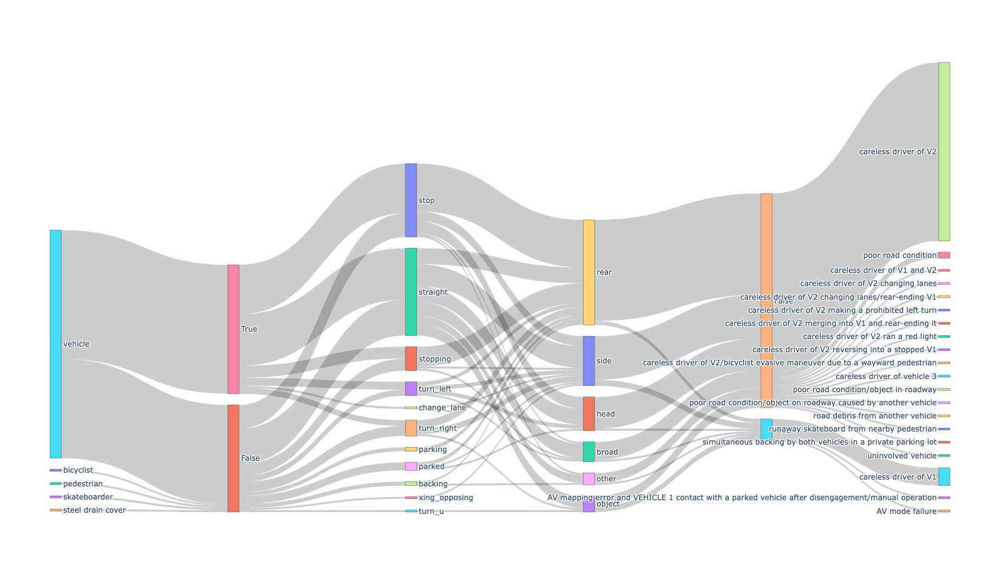](https://htmlpreview.github.io/?https://github.com/bazilinskyy/llm-events/blob/main/figures/accident_overview_sankey.html)

Accident overview Sankey diagram showing the flow of parsed accident attributes across the selected plot fields.

#### Accident 5W1H Sankey diagram

[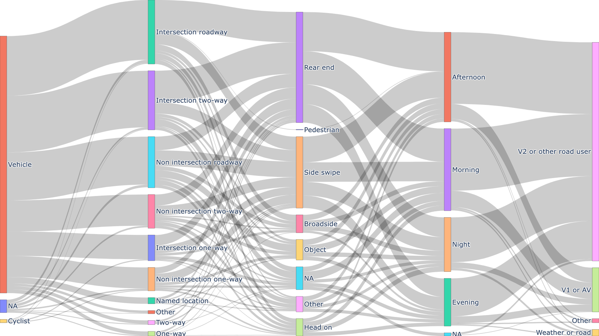](https://htmlpreview.github.io/?https://github.com/bazilinskyy/llm-events/blob/main/figures/accident_5w1h_sankey.html)

Accident 5W1H Sankey diagram showing the flow across who, where, what, when, and why storyline dimensions.

#### Accident overview sunburst diagram

[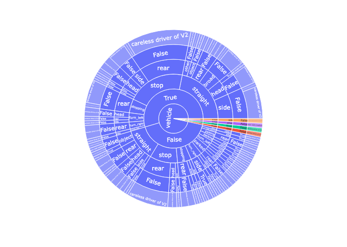](https://htmlpreview.github.io/?https://github.com/bazilinskyy/llm-events/blob/main/figures/accident_overview_sunburst.html)

Accident overview sunburst diagram showing the hierarchical distribution of accident attributes across the selected plot fields.

#### Accident transition graph

[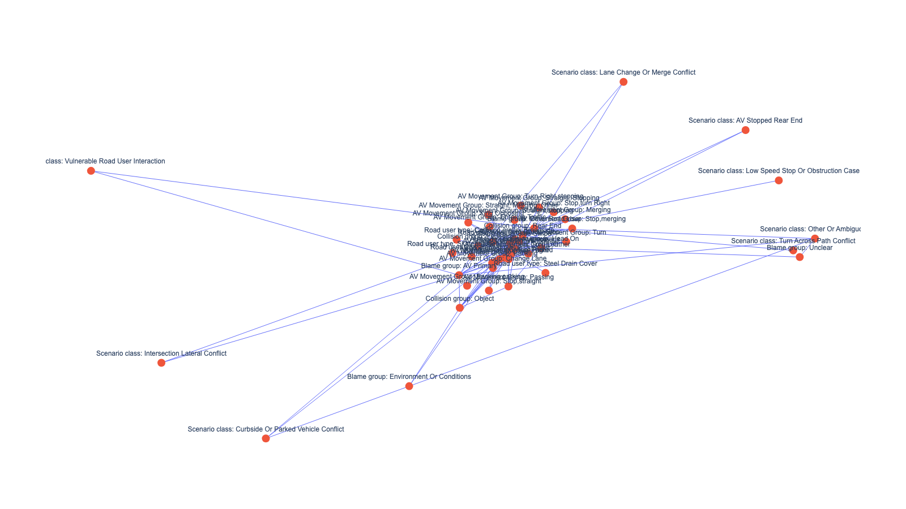](https://htmlpreview.github.io/?https://github.com/bazilinskyy/llm-events/blob/main/figures/accident_transition_graph.html)

Accident transition graph showing connections between consecutive accident attributes across the selected plot fields.

#### Accident location map

[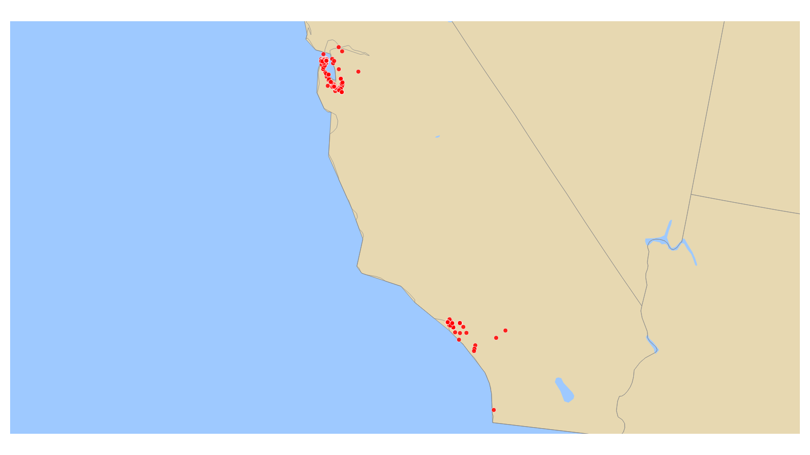](https://htmlpreview.github.io/?https://github.com/bazilinskyy/llm-events/blob/main/figures/accident_location_map.html)

Accident location map showing geocoded accident report locations derived from questionnaire address fields.

### Histogram figures

#### Histogram of road user type

[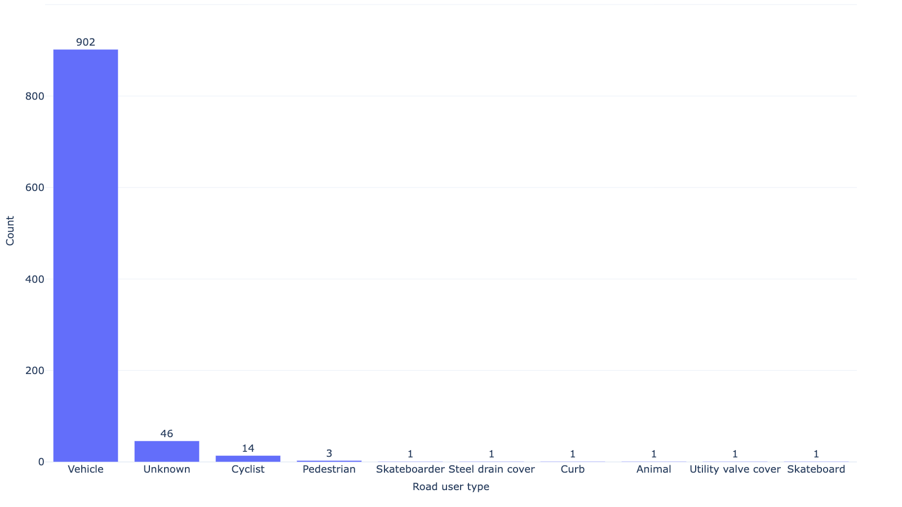](https://htmlpreview.github.io/?https://github.com/bazilinskyy/llm-events/blob/main/figures/road_user_type.html)

Histogram of road user types extracted from the accident reports.

#### Histogram of collision group

[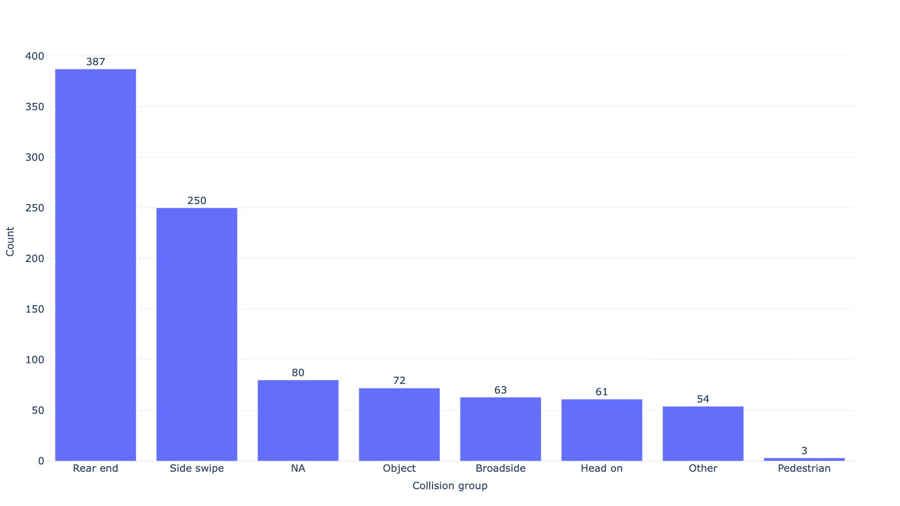](https://htmlpreview.github.io/?https://github.com/bazilinskyy/llm-events/blob/main/figures/collision_group.html)

Histogram of collision groups extracted from the accident reports.

#### Histogram of blame group

[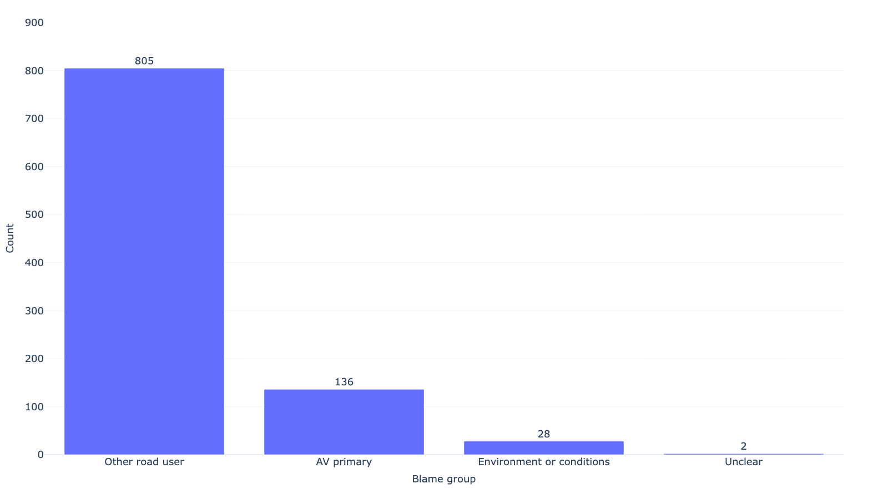](https://htmlpreview.github.io/?https://github.com/bazilinskyy/llm-events/blob/main/figures/blame_group.html)

Histogram of blame groups extracted from the accident reports.

#### Histogram of scenario class

[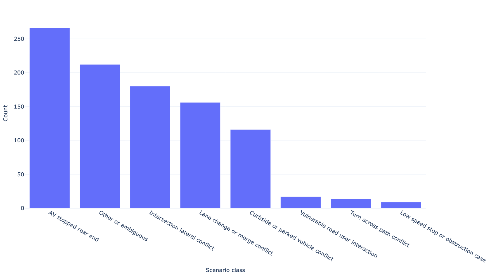](https://htmlpreview.github.io/?https://github.com/bazilinskyy/llm-events/blob/main/figures/scenario_class.html)

Histogram of scenario classes derived from the accident reports.

### Research figures

#### Taxonomy overview

[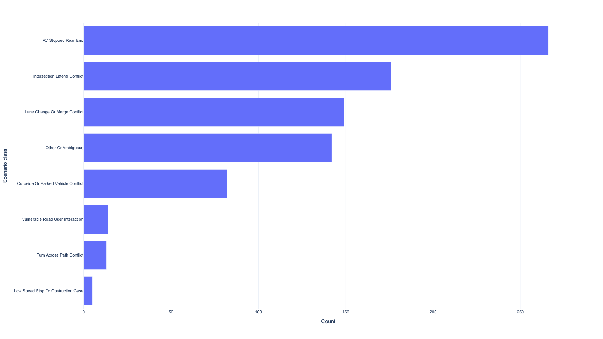](https://htmlpreview.github.io/?https://github.com/bazilinskyy/llm-events/blob/main/figures/taxonomy_overview.html)

Bar chart showing the most frequent scenario classes in the empirical accident subset.

#### Post extraction unavailability

[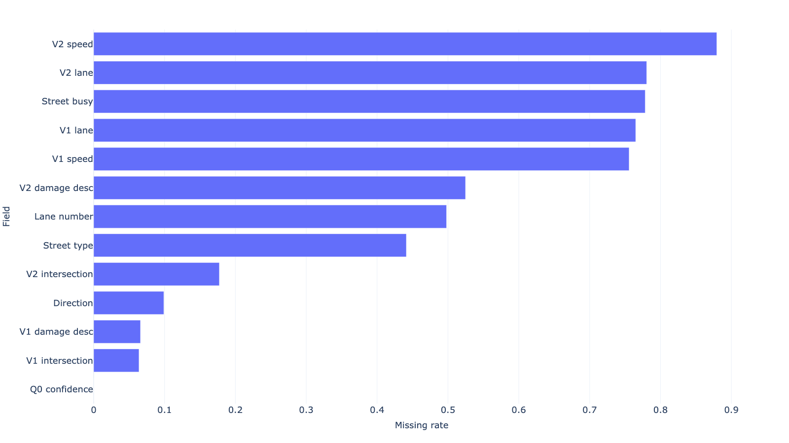](https://htmlpreview.github.io/?https://github.com/bazilinskyy/llm-events/blob/main/figures/blind_spots_missingness.html)

Bar chart showing unavailable values after extraction across selected context fields. The chart does not identify whether the source report, the form design, or the extraction process accounts for an unavailable value.

#### Accountability by taxonomy

[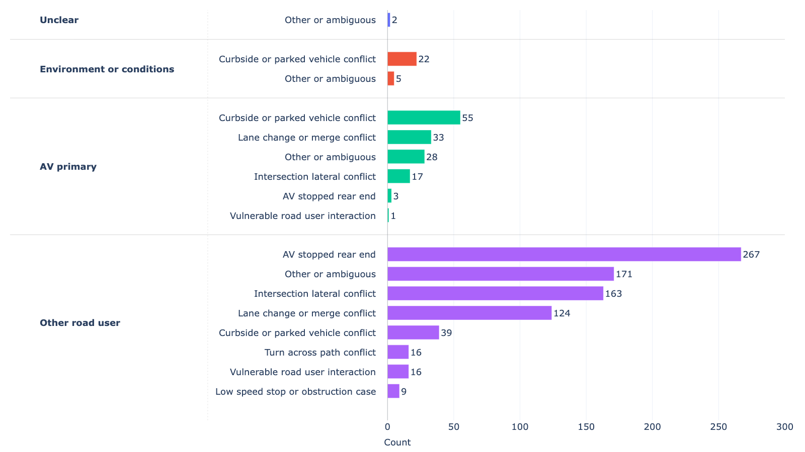](https://htmlpreview.github.io/?https://github.com/bazilinskyy/llm-events/blob/main/figures/accountability_by_taxonomy.html)

Chart showing how blame assignments vary across the most common scenario classes.

#### Report completeness

[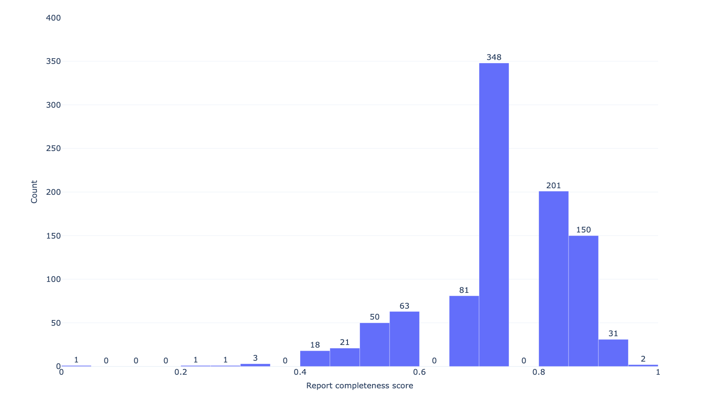](https://htmlpreview.github.io/?https://github.com/bazilinskyy/llm-events/blob/main/figures/report_completeness.html)

Figure showing report completeness scores across the parsed accident reports.

#### Taxonomy by road user

[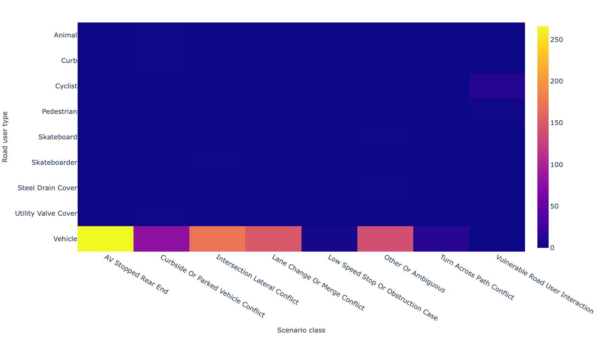](https://htmlpreview.github.io/?https://github.com/bazilinskyy/llm-events/blob/main/figures/taxonomy_by_road_user.html)

Chart showing how scenario classes vary by road user type.

#### Provenance availability

[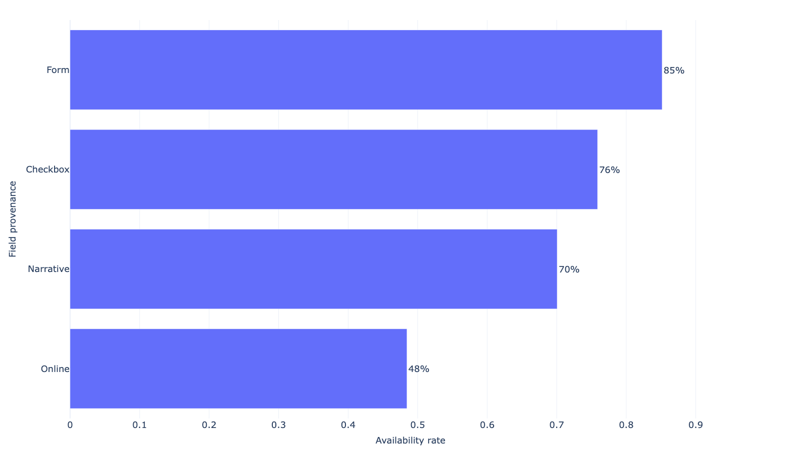](https://htmlpreview.github.io/?https://github.com/bazilinskyy/llm-events/blob/main/figures/provenance_availability.html)

Figure showing mean field availability by provenance source.

#### Context gap

[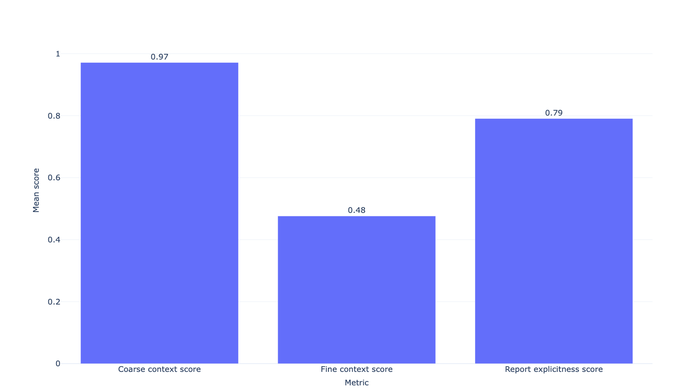](https://htmlpreview.github.io/?https://github.com/bazilinskyy/llm-events/blob/main/figures/context_gap.html)

Figure comparing coarse report context, fine report context, and external online context availability.

#### Movement field agreement

[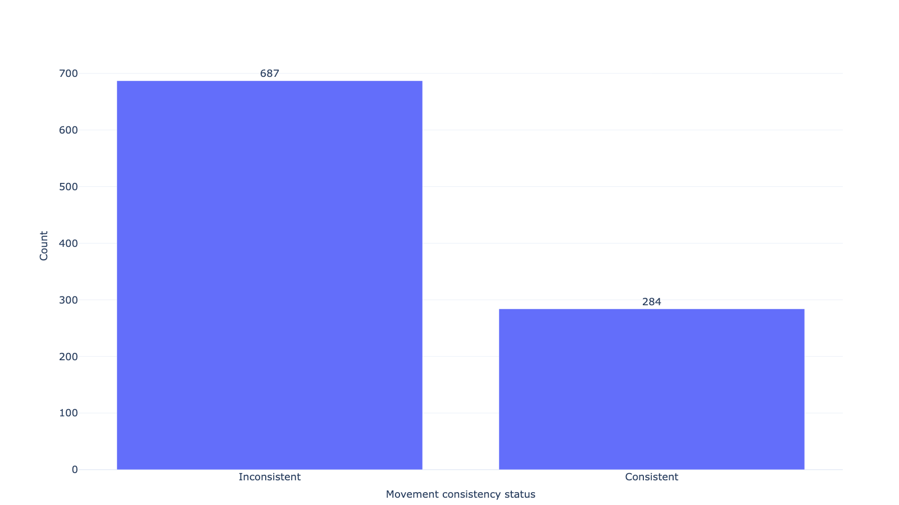](https://htmlpreview.github.io/?https://github.com/bazilinskyy/llm-events/blob/main/figures/movement_consistency.html)

Figure showing exact, compatible, contradictory, and unavailable movement comparisons across checkbox and narrative fields.

#### Scenario rule support

[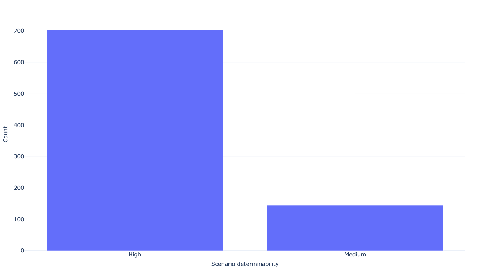](https://htmlpreview.github.io/?https://github.com/bazilinskyy/llm-events/blob/main/figures/scenario_determinability.html)

Figure showing internal rule support for deterministic scenario assignments. This measure is not a validated classification accuracy score.

#### Environment profile

[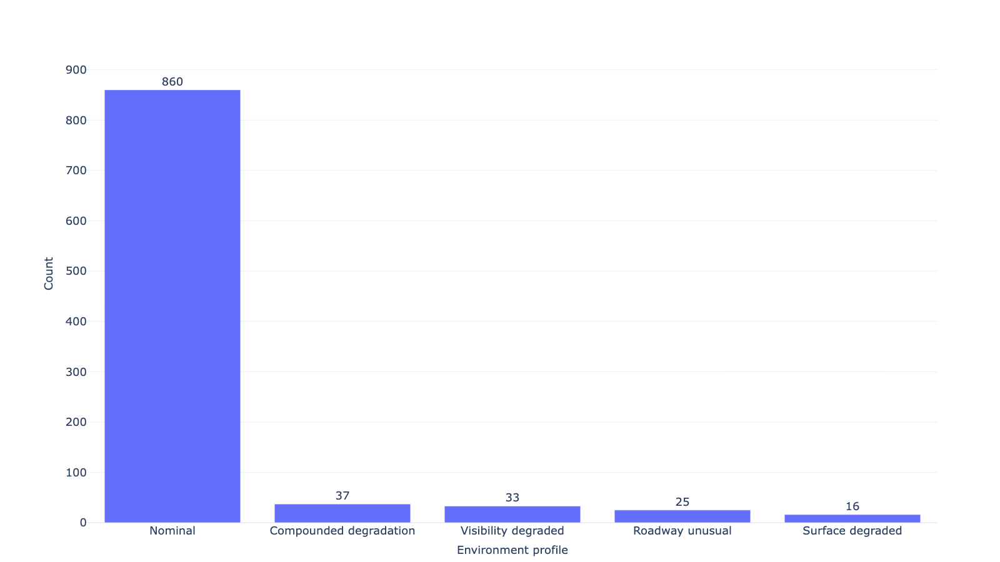](https://htmlpreview.github.io/?https://github.com/bazilinskyy/llm-events/blob/main/figures/environment_profile.html)

Figure showing the distribution of environmental friction profiles across the accident set.

#### Blame confidence alignment

[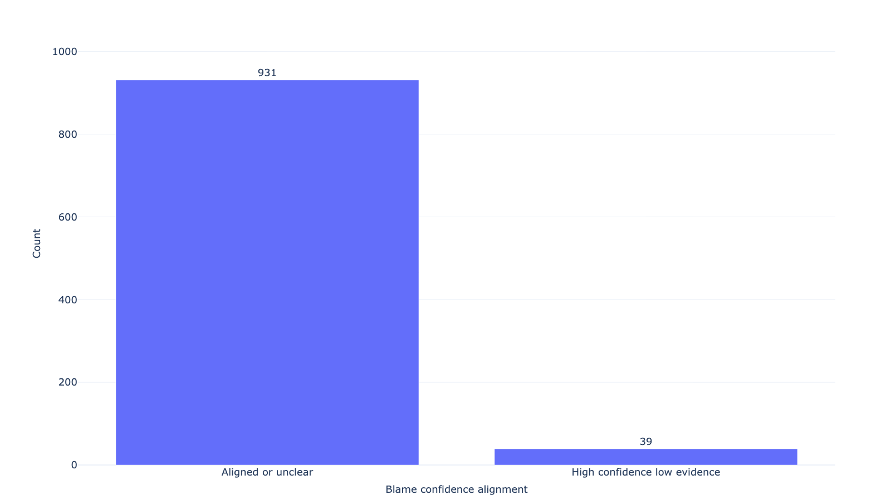](https://htmlpreview.github.io/?https://github.com/bazilinskyy/llm-events/blob/main/figures/blame_confidence_alignment.html)

Figure showing alignment between blame assignment and confidence related evidence.

#### Stopped AV subtype

[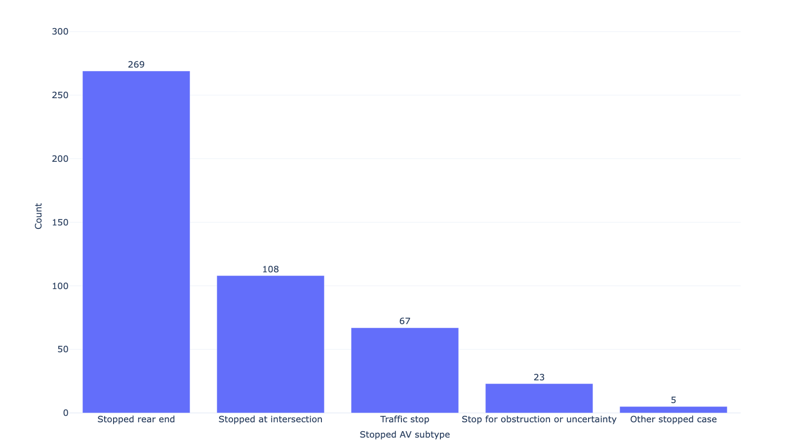](https://htmlpreview.github.io/?https://github.com/bazilinskyy/llm-events/blob/main/figures/stopped_av_subtype.html)

Figure showing subtype patterns within stopped automated vehicle scenarios.

#### Intersection detail quality

[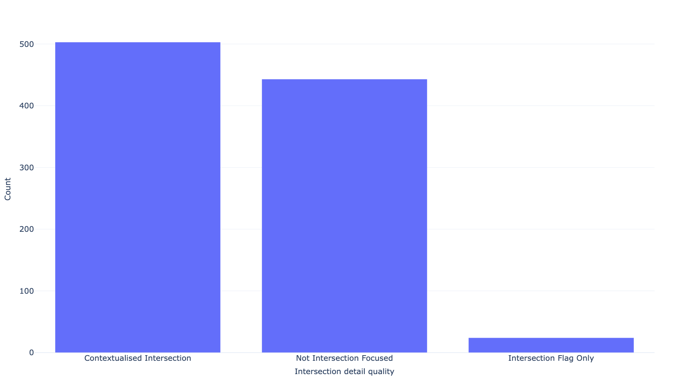](https://htmlpreview.github.io/?https://github.com/bazilinskyy/llm-events/blob/main/figures/intersection_detail_quality.html)

Figure showing the quality and completeness of intersection related detail in the parsed reports.

## Injury status interpretation

`reported_injury_status` is a conservative extraction based category.

`no_injury_marked` means that the extracted injury fields contained an explicit `None` or no injury marker. It does not establish a clinically verified absence of injury.

`reported_injury` and `reported_fatality` refer to what was marked in the extracted fields and should not be interpreted as independently validated medical outcomes.

## Reproducibility notes

The deterministic analysis and validation settings should be retained when producing the final paper results.

For human validation in particular, preserve:

```text
data/validation_100.csv
_validation/validation_set_id.txt
_validation/reviewer_orders.csv
```

The shared validation list defines the exact source reports selected for human review. The validation set ID confirms the report set, while reviewer order records document that the two reviewers received the same reports in different orders.

Original Reviewer 1 and Reviewer 2 annotations should always be retained even if disagreements are later adjudicated.
