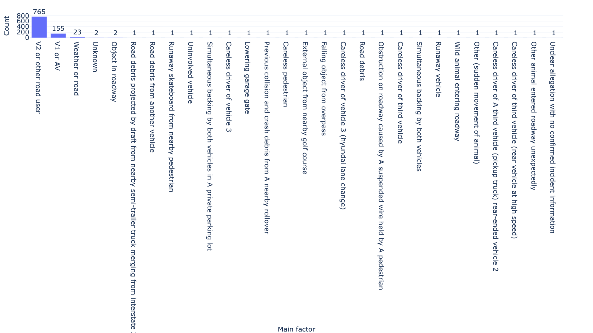

# LLM events refactor

## Citation and usage of code
If you use this work for academic work please cite the following paper:

> 

The code is open-source and free to use. It is aimed for, but not limited to, academic research. We welcome forking of this repository, pull requests, and any contributions in the spirit of open science and open-source code. For inquiries about collaboration, you may contact Md Shadab Alam (md_shadab_alam@outlook.com) or Pavlo Bazilinskyy (pavlo.bazilinskyy@gmail.com).

## Getting started
[](https://www.python.org/downloads/release/python-3919/)
[](https://docs.astral.sh/uv/)

Tested with **Python 3.12.13** and the [`uv`](https://docs.astral.sh/uv/) package manager.
Follow these steps to set up the project.

**Step 1:** Install `uv`. `uv` is a fast Python package and environment manager. Install it using one of the following methods:

**macOS / Linux (bash/zsh):**
```bash
curl -LsSf https://astral.sh/uv/install.sh | sh
```

**Windows (PowerShell):**
```powershell
irm https://astral.sh/uv/install.ps1 | iex
```

**Alternative (if you already have Python and pip):**
```bash
pip install uv
```

**Step 2:** Fix permissions (if needed):

Sometimes `uv` needs to create a folder under `~/.local/share/uv/python` (macOS/Linux) or `%LOCALAPPDATA%\uv\python` (Windows).
If this folder was created by another tool (e.g. `sudo`), you may see an error like:
```lua
error: failed to create directory ... Permission denied (os error 13)
```

To fix it, ensure you own the directory:

### macOS / Linux
```bash
mkdir -p ~/.local/share/uv
chown -R "$(id -un)":"$(id -gn)" ~/.local/share/uv
chmod -R u+rwX ~/.local/share/uv
```

### Windows
```powershell
# Create directory if it doesn't exist
New-Item -ItemType Directory -Force "$env:LOCALAPPDATA\uv"

# Ensure you (the current user) own it
# (usually not needed, but if permissions are broken)
icacls "$env:LOCALAPPDATA\uv" /grant "$($env:UserName):(OI)(CI)F"
```

**Step 3:** After installing, verify:
```bash
uv --version
```

**Step 4:** Clone the repository:
```command line
git clone https://github.com/bazilinskyy/llm-events.git
cd llm-events
```

**Step 5:** Ensure correct Python version. If you don’t already have Python 3.12.13 installed, let `uv` fetch it:
```command line
uv python install 3.12.13
```
The repo should contain a .python-version file so `uv` will automatically use this version.

**Step 6:** Create and sync the virtual environment. This will create **.venv** in the project folder and install dependencies exactly as locked in **uv.lock**:
```command line
uv sync --frozen
```

**Step 7:** Activate the virtual environment:

**macOS / Linux (bash/zsh):**
```bash
source .venv/bin/activate
```

**Windows (PowerShell):**
```powershell
.\.venv\Scripts\Activate.ps1
```

**Windows (cmd.exe):**
```bat
.\.venv\Scripts\activate.bat
```

**Step 8:** Ensure that dataset are present. Place required datasets (including **mapping.csv**) into the **data/** directory:


**Step 9:** Run the code:
```command line
python3 analysis.py
```

### Configuration of project
Configuration of the project needs to be defined in `config`. Please use the `default.config` file for the required structure of the file. If no custom config file is provided, `default.config` is used. The config file has the following parameters:
- **`data`**: Path to the input CSV file containing the LLM generated output to be parsed and analysed.
- **`output_dir`**: Directory where processed CSV files, summary files, and generated plots are saved. All generated figures are saved directly into this directory.
- **`figures_dir`**: Directory where final copies of figures are saved when `save_final` is enabled.
- **`logger_level`**: Logging level used during execution, such as `INFO`, `DEBUG`, `WARNING`, or `ERROR`.
- **`auto_open_html`**: Automatically opens generated HTML plots in the default browser after they are created.
- **`save_final`**: Saves final copies of figures into `figures_dir` in addition to the standard output location.
- **`filter_rows_with_na`**: Filters out rows from the plotting dataset when important parsed fields contain missing values.
- **`na_filter_fields`**: List of parsed fields considered critical for filtering. If any of these fields are missing and `filter_rows_with_na` is enabled, the corresponding row is excluded from the plots.
- **`include_plot_fields`**: Ordered list of parsed fields to include in the overview plots such as the Sankey diagram, sunburst diagram, and transition graph.
- **`exclude_plot_fields`**: List of parsed fields to remove from the configured plot fields, allowing quick experimentation with different figure layouts.
- **`histogram_fields`**: List of parsed fields for which histogram style summary plots are generated.
- **`blind_spot_fields`**: List of detailed context fields used in blind spot and missingness analysis.
- **`max_categories`**: Maximum number of categories retained per stage in the overview plots before less frequent values are grouped into `Other`.
- **`min_count`**: Minimum count threshold for links in the Sankey diagram. Links below this threshold are excluded from the figure.
- **`row_keep_policy`**: Controls which response rows are kept before parsing. Supported values are `output_only`, `best_available`, and `best_per_row`.
- **`validation_sample_size`**: Number of rows sampled for the validation output table.
- **`validation_seed`**: Random seed used when generating the validation sample.
- **`validation_include_text`**: Whether the validation sample should include the source text used for parsing.
- **`paper_plot_top_n`**: Number of top categories retained in selected paper style plots.


## Results
### Overview figures

#### Accident overview Sankey diagram
[](https://htmlpreview.github.io/?https://github.com/bazilinskyy/llm-events/blob/main/figures/accident_overview_sankey.html)
Accident overview Sankey diagram showing the flow of parsed accident attributes across the selected plot fields.

#### Accident overview sunburst diagram
[](https://htmlpreview.github.io/?https://github.com/bazilinskyy/llm-events/blob/main/figures/accident_overview_sunburst.html)
Accident overview sunburst diagram showing the hierarchical distribution of accident attributes across the selected plot fields.

#### Accident transition graph
[](https://htmlpreview.github.io/?https://github.com/bazilinskyy/llm-events/blob/main/figures/accident_transition_graph.html)
Accident transition graph showing connections between consecutive accident attributes across the selected plot fields.

### Histogram figures

#### Histogram of road user type
[](https://htmlpreview.github.io/?https://github.com/bazilinskyy/llm-events/blob/main/figures/road_user_type.html)
Histogram of road user types extracted from the accident reports.

#### Histogram of collision group
[](https://htmlpreview.github.io/?https://github.com/bazilinskyy/llm-events/blob/main/figures/collision_group.html)
Histogram of collision groups extracted from the accident reports.

#### Histogram of blame group
[](https://htmlpreview.github.io/?https://github.com/bazilinskyy/llm-events/blob/main/figures/blame_group.html)
Histogram of blame groups extracted from the accident reports.

#### Histogram of scenario class
[](https://htmlpreview.github.io/?https://github.com/bazilinskyy/llm-events/blob/main/figures/scenario_class.html)
Histogram of scenario classes derived from the accident reports.

#### Histogram of main factor grouped
[](https://htmlpreview.github.io/?https://github.com/bazilinskyy/llm-events/blob/main/figures/main_factor_grouped.html)
Histogram of grouped main contributing factors extracted from the accident reports.

### Research figures

#### Taxonomy overview
[](https://htmlpreview.github.io/?https://github.com/bazilinskyy/llm-events/blob/main/figures/taxonomy_overview.html)
Bar chart showing the most frequent scenario classes in the empirical accident subset.

#### Blind spots missingness
[](https://htmlpreview.github.io/?https://github.com/bazilinskyy/llm-events/blob/main/figures/blind_spots_missingness.html)
Bar chart showing missingness across fine grained context and blind spot related fields.

#### Accountability by taxonomy
[](https://htmlpreview.github.io/?https://github.com/bazilinskyy/llm-events/blob/main/figures/accountability_by_taxonomy.html)
Chart showing how blame assignments vary across the most common scenario classes.

#### Report completeness
[](https://htmlpreview.github.io/?https://github.com/bazilinskyy/llm-events/blob/main/figures/report_completeness.html)
Figure showing report completeness scores across the parsed accident reports.

#### Taxonomy by road user
[](https://htmlpreview.github.io/?https://github.com/bazilinskyy/llm-events/blob/main/figures/taxonomy_by_road_user.html)
Chart showing how scenario classes vary by road user type.

#### Provenance availability
[](https://htmlpreview.github.io/?https://github.com/bazilinskyy/llm-events/blob/main/figures/provenance_availability.html)
Figure showing mean field availability by provenance source.

#### Context gap
[](https://htmlpreview.github.io/?https://github.com/bazilinskyy/llm-events/blob/main/figures/context_gap.html)
Figure showing gaps between coarse and fine contextual information in the parsed reports.

#### Movement consistency
[](https://htmlpreview.github.io/?https://github.com/bazilinskyy/llm-events/blob/main/figures/movement_consistency.html)
Figure showing movement consistency status across source fields.

#### Scenario determinability
[](https://htmlpreview.github.io/?https://github.com/bazilinskyy/llm-events/blob/main/figures/scenario_determinability.html)
Figure showing how often the available evidence supports high, medium, or low scenario determinability.

#### Environment profile
[](https://htmlpreview.github.io/?https://htmlpreview.github.io/?https://github.com/bazilinskyy/llm-events/blob/main/figures/environment_profile.html)
Figure showing the distribution of environmental friction profiles across the accident set.

#### Blame confidence alignment
[](https://htmlpreview.github.io/?https://github.com/bazilinskyy/llm-events/blob/main/figures/blame_confidence_alignment.html)
Figure showing alignment between blame assignment and confidence related evidence.

#### Stopped AV subtype
[](https://htmlpreview.github.io/?https://github.com/bazilinskyy/llm-events/blob/main/figures/stopped_av_subtype.html)
Figure showing subtype patterns within stopped automated vehicle scenarios.

#### Intersection detail quality
[](https://htmlpreview.github.io/?https://github.com/bazilinskyy/llm-events/blob/main/figures/intersection_detail_quality.html)
Figure showing the quality and completeness of intersection related detail in the parsed reports.